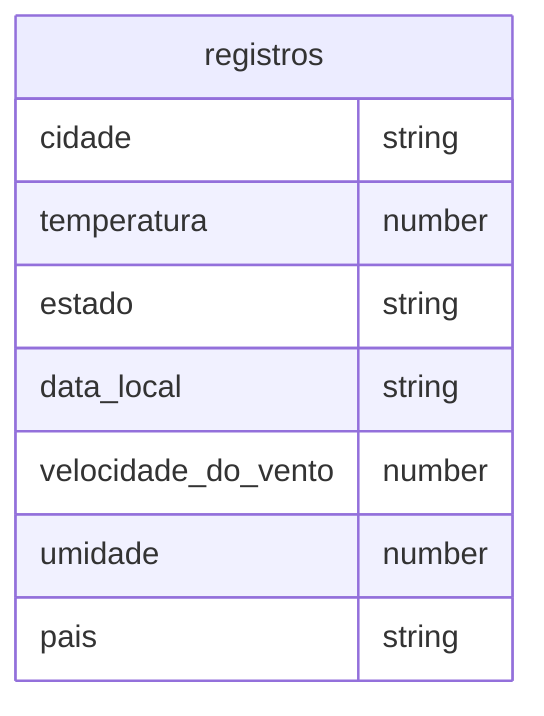

# API de Dados Sobre Tempo ☀️⛈️🌩🌡️
  <h4><i>Esta API envia dados sobre o clima de uma cidade pela solicitação URL</i></h4> 
  <br>


### Como funciona esta API? 🤔
  Ela Funciona a partir de um URL, como outras APIs. Neste caso, para conseguir pegar dados sobre uma cidade, você deve seguir a segunte sintaxe:

<br>
<br>

  
## "nome do Servidor"/cidade/"Nome da Cidade"/json
<br>


### 🟠 Atenção:

O nome da cidade deve estar em maiúsculo, por exemplo:

### "nome do Servidor"/cidade/Jacarezinho/json
  Cada nome de cidade retorna um json com os dados do clima da cidade, no caso, quando solicitado os dados de Jacarezinho irá retornar um json com os seguintes dados
```json
  {
    "cidade": "Jacarezinho",
    "temperatura": "34",
    "estado": "neblina",
    "data_local": "30/05/23 19:45",
    "velocidade_do_vento": "37 km/h",
    "umidade": "20",
    "pais": "Brasil"
  }

```

Dessa maneira, para pegar dados de outra cidade para colocar em seu projeto basta mudar o nome na URL

* As cidades  disponíveis para solicitar dados json estão no arquivo 




<style>
  .atencao {
    color: red;
  }
</style>
