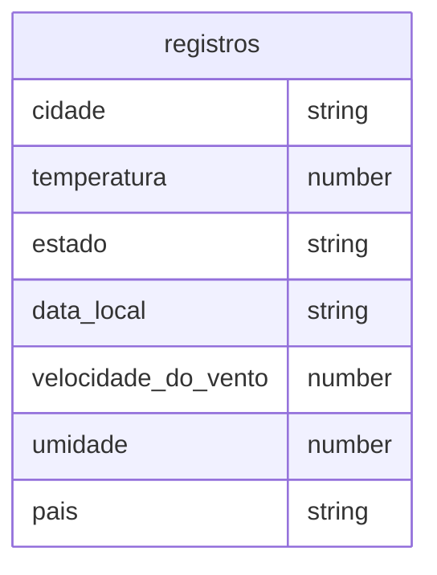

# API de Dados Sobre Tempo ☀️⛈️🌩🌡️
  <h4><i>Esta API envia dados sobre o clima de uma cidade pela solicitação URL</i></h4> 
  <br>


### Como funciona esta API? 🤔
  Ela Funciona a partir de um URL, como outras APIs. Neste caso, para conseguir pegar dados sobre uma cidade, você deve seguir a seguinte sintaxe:

<br>

  
## "nome do Servidor"/cidade/"Nome da Cidade"/json
<br>


### 🟠 Atenção:

O nome da cidade deve estar em maiúsculo, por exemplo:


### "nome do Servidor"/cidade/Jacarezinho/json

<br>

  Cada nome de cidade retorna um json com os dados de clima da cidade, no caso, quando solicitado os dados de Jacarezinho irá retornar um json com os seguintes dados:
```json
  {
    "cidade": "Jacarezinho",
    "temperatura": "34",
    "estado": "neblina",
    "data_local": "30/05/23 19:45",
    "velocidade_do_vento": "37 km/h",
    "umidade": "20",
    "pais": "Brasil"
  }

```

> Dessa maneira, para pegar dados de outra cidade para colocar em seu projeto basta mudar o nome na URL

* <a href='https://github.com/AlexandreBitelo/Projeto-Tempo/blob/main/dadosDoBanco.js'><button>Cidades Disponíveis</button></a>

<br>
<br>

### Como foi feito o código?
Ele consiste em uma API símples, que conecta com um banco de dados local e envia dados para o browser por uma solicitação pelo protocolo HTTP.
O banco de dados foi feito dentro do código JavaScript. Portanto, para ver o código você deve entrar em [index.js](https://github.com/AlexandreBitelo/Projeto-Tempo/blob/main/index.js) e ver os códigos específicos para banco de dados, o banco de dados usado foi o SQLite.

<br>

* Modelagem do Banco


<br>
<br>

Esta API foi criada como um projeto final do curso de Desenvolvimento Back-End que fiz no Senac.


<br>
<br>

Qualquer Dúvida ou sugestões pode me contactar pelas redes que estão no meu perfil [Alexandre Bitelo](https://github.com/AlexandreBitelo)

<br>
<br>

## Obrigado por acessar meu repositório! Rumo ao desenvolvimento! 👨‍💻


